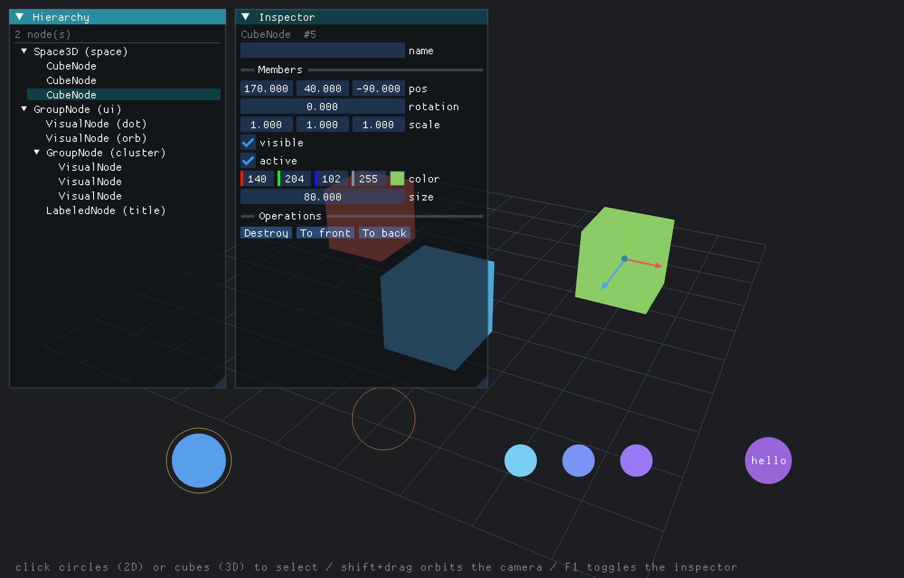

# tcxNodeInspector

A runtime **hierarchy + inspector** for TrussC's `Node` graph — a Unity-style
debug panel you drop into any app. It shows the live node tree, lets you select
a node (in the tree **or** by clicking it on the canvas), and edits that node's
reflected members in place. A draggable move / rotate gizmo sits on the
selection on the canvas.

It builds entirely on framework features that already ship in core
(`TC_REFLECT` reflection, the `getSelectedNode`/`setSelectedNode` selection,
and overlay input arbitration so clicking the panel never drops your
selection) plus [`tcxImGui`](https://github.com/TrussC-org/TrussC) for drawing.



## Use it

Add the addon (and its `tcxImGui` dependency) to your project's `addons.make`:

```
tcxImGui
tcxNodeInspector
```

Then keep one `NodeInspector` and draw it inside your ImGui frame:

```cpp
#include <tcxNodeInspector.h>
using namespace tcx;

class tcApp : public App {
    NodeInspector inspector_;
    RectNode::Ptr sceneRoot_;

    void setup() override {
        imguiSetup();
        sceneRoot_ = make_shared<RectNode>();
        addChild(sceneRoot_);
        // ... build your scene under sceneRoot_ ...
    }

    void draw() override {
        imguiBegin();
        inspector_.draw(*sceneRoot_);   // tree + inspector + gizmo
        imguiEnd();
    }
};
```

That's it. Any node whose type uses `TC_REFLECT` exposes its fields in the
Inspector; nodes that `enableEvents()` and provide a hit-test are selectable by
clicking them on the canvas.

## Make a node inspectable / selectable

```cpp
struct Sprite : Node {
    Color color{1, 1, 1, 1};
    float radius = 30;

    Sprite() { enableEvents(); }    // make it a canvas hit-test target

    bool hitTest(const Ray& r, float& outDist) override {  // circle pick
        const Ray::Hit h = r.intersectZPlane();
        if (!h.hit) return false;
        if (h.point.x*h.point.x + h.point.y*h.point.y <= radius*radius) { outDist = h.t; return true; }
        return false;
    }

    TC_REFLECT(Sprite, Node) {      // list the direct base: Node's pos/rotation/... chain in
        TC_VALUE(color)
        TC_VALUE(radius)
        TC_VALUE(alive, isAlive)              // getter only = read-only (greyed out)
        TC_VALUE(speed, getSpeed, setSpeed)   // getter + setter = editable
    }
};
```

The Inspector renders each reflected type with the matching ImGui widget
(`float`/`int`/`bool`/`Vec2`/`Vec3`/`Color`/`string`). Enum values render as a
combo of their labels when the enum declares them (`TC_ENUM_LABELS`, optional —
without labels an enum edits as a plain int), and getter-only values render
greyed out. The Inspector always uses the built-in `tcx::ImGuiReflector`, and
there is no way to plug in a subclass yet. A subclass that overrides a
`visit()` only helps in an ImGui panel your app draws itself (call
`node->reflectMembers(r)` there). It does not change the Inspector.

## Mods

Mods reflect too (a `TC_REFLECT` block with `Mod` as the base) — the Inspector
shows one section per attached mod under the node's members, edited through the
same reflector. Core's `LayoutMod` and `TweenMod` ship reflected, so e.g.
flipping a LayoutMod's `direction` combo re-stacks its children live, while a
playing TweenMod shows its read-only `playing` / `progress` next to the
editable `duration` / easing combos.

## Gizmo (move + rotate)

Selecting a node shows a Unity-style gizmo at its origin, built from the node's
**local** X/Y/Z frame (it rotates with the node) in soft red / green / blue
with a constant on-screen size:

- **Move** (default): axis arrows along the node's local frame. Drag one to
  move the node along that axis.
- **Rotate** (hold **Shift**): GIMBAL rings — one per euler channel of the
  Y-X-Z decomposition (yaw = the parent frame's Y, pitch = that Y-rotated X,
  roll = the node's local Z). Dragging a ring changes exactly that one
  rotation number in the inspector, through the same numeric path as editing
  the field. The mode is locked while a drag is in flight — releasing Shift
  mid-rotate keeps rotating until mouse-up.

Gizmo gestures are **consumed** (the node tree never sees a click or drag that
was gizmo input) and solved in world space against the cursor ray, so they
track exactly under perspective and inside an EasyCam scope. An axis pointing
straight at the camera hides itself; deltas land in the parent's coordinate
space, so nested nodes behave. The hot handle highlights.

## Multi-selection

**Cmd/Ctrl+click** (canvas or tree) toggles nodes in and out of a
multi-selection; a plain click anywhere collapses back to a single node. The
selection lives in the inspector — core keeps its simple single "last picked"
selection, which stays the **primary** (what the Inspector panel shows; the
panel notes how many more are selected).

With 2+ nodes selected the gizmo moves to the selection **centroid** and each
member gets a small ring marker. The gizmo's axes use the nodes' **shared
frame** when every global orientation matches, and fall back to the **world
axes** when they don't (like Unity's Global mode). Dragging applies one world
delta to every selected node — across hierarchies and even across camera
scopes, since all nodes share one world space. Rotation rings stay
single-node.

```cpp
inspector_.getSelection();          // all selected nodes (primary included)
inspector_.toggleInSelection(n);    // what Cmd/Ctrl+click does
inspector_.select(n);               // replace (what a plain click does)
inspector_.clearSelection();
```

```cpp
inspector_.setGizmoScale(1.5f);              // scale all gizmo dimensions
inspector_.style().gizmoDraggable = false;   // display-only gizmo
inspector_.style().gizmoLength    = 35.0f;   // handle length / ring radius (screen px)
inspector_.style().gizmoThickness = 2.0f;    // handle width (px)
```

## What the user changed (touched)

The inspector records every value the user changes by hand, per node: a
member edited in the Inspector panel (nested members as a path such as
`outline.color`, mod members under the mod's type), the name field, and the
`pos` / `rotation` of every node moved or rotated with the gizmo. Changes made
from code, or by the MCP tool `tc_set_node_members`, are not recorded.

With MCP on, `tcx_imgui_get_touched` returns the record under `inspector`,
next to tcxImGui's own `widgets`. Each entry carries the member's current value
in the `tc_get_node_tree` encoding (rotation in degrees, colors `[r,g,b,a]`):

```json
{"nodeType": "Ball", "nodeName": "a", "nodeId": 2, "member": "outline.color",
 "value": [0, 0.2, 0.2, 1]}
```

A destroyed node reports `"destroyed": true`, and a removed mod
`"modRemoved": true`, each with the value as of the last edit.
`tcx_imgui_reset_touched` clears the record. From code:

```cpp
NodeInspector::instance().getTouched();     // the same JSON array
NodeInspector::instance().resetTouched();
```

The Hierarchy / Inspector panels are kept out of tcxImGui's `widgets` record:
their widgets are shared by whichever node is selected, so an ImGui widget ID
can't say whose value it was. Only the Inspector's own `ImGuiReflector` feeds
this record. A subclass used in your own panel fills its `edited` list when it
calls `edit(name, widget)`, but nothing moves that list into the record. The
old `edit(widget)` form still works but fills nothing.

## Styling

Inspectors get cramped fast, so the defaults are **compact** with a
**semi-transparent** background, and an **accent** color recolors the title bars
and selection so the panels read as distinct from your app's own ImGui windows.

```cpp
inspector_.setAccent(Color(0.16f, 0.55f, 0.62f))   // teal (default)
          .setWindowAlpha(0.90f)                   // default 0.65
          .setCompact(true);                       // default true
inspector_.style().showGizmo = false;              // hide the canvas gizmo
```

The whole tool can be switched off at runtime — panels *and* gizmo disappear,
while the underlying selection is left alone (re-enabling picks up where you
left off). Handy on a debug key:

```cpp
void keyPressed(const KeyEventArgs& e) override {
    if (e.key == KEY_F1) inspector_.toggle();    // or setEnabled(bool) / isEnabled()
}
```

You can also place the panels yourself instead of calling `draw()`:

```cpp
inspector_.drawHierarchy(*sceneRoot_);
inspector_.drawInspector();
inspector_.drawGizmo();
```

## Example

`example-basic/` builds one scene that exercises everything at once — nested
hierarchy, reflected members of several types, a Mod that draws and handles keys,
canvas + tree selection, and the gizmo.

```bash
cd example-basic
trusscli update     # generate build files
trusscli run        # build + launch
```

## License

MIT — see [LICENSES.md](LICENSES.md).
